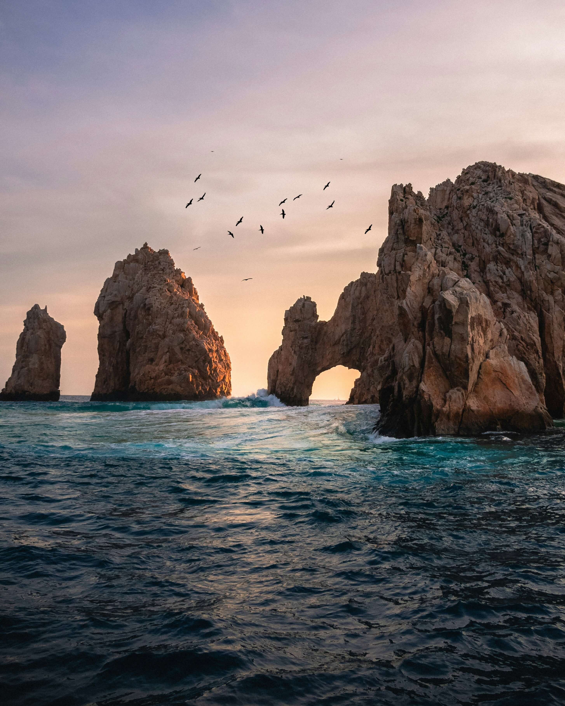

# Tripleten web_project_around
Tecnologias utilizadas
1.- html
2.-Css
3.-Java Script

Pagina interactiva donde los usuarios podran añadir, eliminar o dar me gusta a las imagenes

link de GitHub
https://ingjesuss.github.io/web_project_around/

            <!-- 4ta card -->
            

              
              

                <h3 class="card__container-title">
                  Cabo San Lucas,Baja Califormin
                </h3>
                <button class="card__container-btn"></button>
              

            

            <!-- 5ta card -->
            

              
              

                <h3 class="card__container-title">Rio de Janeiro, Brasil</h3>
                <button class="card__container-btn"></button>
              

            

            <!-- 6ta card -->
            

              
              

                <h3 class="card__container-title">Islandia</h3>
                <button class="card__container-btn"></button>
              

            

          
